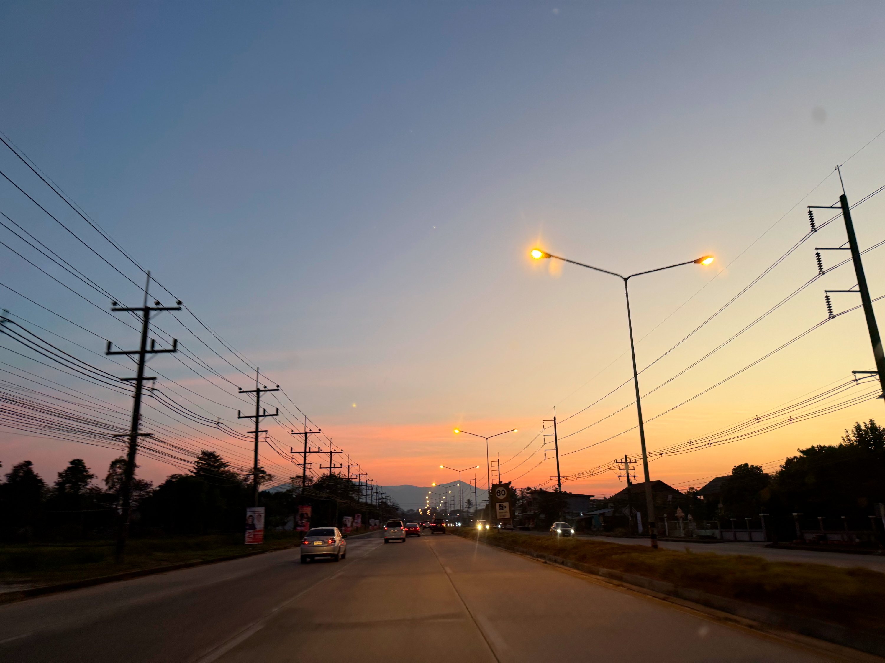

# 20250120_chiangrai

<html>
<head>

<meta charset="UTF-8">
<meta http-equiv="Content-Type" content="text/html; charset=UTF-8">
<meta http-equiv="X-UA-Compatible" content="IE=EmulateIE10" />
<meta http-equiv="X-UA-Compatible" content="IE=edge">

<!--ここから上はお決まりの定型文です-->

<!--ここからが表現の書式などを決めるcssという部分-->

<link href="https://cdnjs.cloudflare.com/ajax/libs/lightbox2/2.7.1/css/lightbox.css" rel="stylesheet">

</head>

<body>

モバイル端末をお使いの場合は、画面を横向きにすると
より見やすくご覧頂けます。

<!--ここ上は、ほぼそのまま使います！-->

<!--QRコードの挿入例-->

 アクセス用QRコード

<marquee direction="left" scrollamount="20" width="30%">(^_^)/~alis</marquee>

<!--流れ文字の挿入例-->
<h1><marquee behavior="left">!!! 2025/01/20、タイにいるのに、Net遊び!!!</marquee></h1>

                          

<!--ここから下が、本体部分-->

<h2>4日続けて西の空にお月様が沈んで行く映像はもうすぐ半月に 20日 朝7:05</h2>

<h2>昨日よりさらに空の高いところで、掛け方はもうすぐ半月</h2>

<h2>ちょっと遅れてお日様も上がります 朝7:09</h2>

<h2>タイにきて初めてのカップラーメン、 スープのほかに折りたたみフォークまで入ってました</h2>

<h2>庭になったパパイヤを収穫、この大きさだと日本で買うと大変なことに</h2>

<h2>残った実ももうすぐ刈り取れます</h2>

<h2>洗濯物はいつものようにあっという間に乾きます</h2>

<h2>登れなかった坂を4日でクリアした４歳児、成長が早い！ 画像クリックで動画再生します ↓</h2>

<h2>王室カレンダーの別バージョンがありました</h2>

<h2>企業系のカレンダーもあります</h2>

<h2>日本のメタバースに繋いでIT系メンバーとの親交を深めます 24日から解禁になるネットゲーム談義が花開いてました</h2>

<h2>詳しいメンバーがメタバース内のパネルでゲームの説明してくれました</h2>
<iframe width="560" height="315" src="https://www.youtube.com/embed/GJFb_Wn7RnQ?si=rP5Yo4yu9cvr-TlT" title="YouTube video player" frameborder="0" allow="accelerometer; autoplay; clipboard-write; encrypted-media; gyroscope; picture-in-picture; web-share" referrerpolicy="strict-origin-when-cross-origin" allowfullscreen></iframe> 

<h2>ゲームにあたっての注意事項を説明するYouTube動画もありますね</h2>
<iframe width="560" height="315" src="https://www.youtube.com/embed/efVyrq5fL8c?si=6IqrlLZn2ooS64Pe" title="YouTube video player" frameborder="0" allow="accelerometer; autoplay; clipboard-write; encrypted-media; gyroscope; picture-in-picture; web-share" referrerpolicy="strict-origin-when-cross-origin" allowfullscreen></iframe> 

<h2>BGMはYouTubeで、年相応にAir Supply</h2>
<iframe width="560" height="315" src="https://www.youtube.com/embed/dgV0dwd1CZ0?si=-B664Pwlyo0rdZrk" title="YouTube video player" frameborder="0" allow="accelerometer; autoplay; clipboard-write; encrypted-media; gyroscope; picture-in-picture; web-share" referrerpolicy="strict-origin-when-cross-origin" allowfullscreen></iframe> 

<h2>洋楽は飽きたので邦楽に切り替えてそのまま再生 2曲目のあいみょん「裸の心」が耳について何度も再生しちゃいました</h2>
<iframe width="560" height="315" src="https://www.youtube.com/embed/eosSZQSN5Mg?si=v8YZPWIyWJIs76rl" title="YouTube video player" frameborder="0" allow="accelerometer; autoplay; clipboard-write; encrypted-media; gyroscope; picture-in-picture; web-share" referrerpolicy="strict-origin-when-cross-origin" allowfullscreen></iframe> 

<h2>あいみょんで検索したら、5年前に生で動画アップされてました・・・これが真の姿</h2>
<iframe width="560" height="315" src="https://www.youtube.com/embed/Pzqpux-TGS8?si=jGWPUCIozwvKr8_c" title="YouTube video player" frameborder="0" allow="accelerometer; autoplay; clipboard-write; encrypted-media; gyroscope; picture-in-picture; web-share" referrerpolicy="strict-origin-when-cross-origin" allowfullscreen></iframe>

<h2>吉田拓郎氏がこの歌詞を誉めたとのこと コメント欄でも80代の高齢男性が絶賛している書き込みがありますね！ 自分も彼らの言うことがよくわかる年齢になりました</h2>

<h2>この日も夕焼けグラデーションになり始めました</h2>

<h2>椰子の葉の向こうに夕陽が沈みます</h2>

<h2>遠くの山々が夕焼けバックにシルエット</h2>

<h2>夕焼けの焼けはじめから30分ほどで見事なグラデーション</h2>

<h2>日が暮れると、金星の左下に木星も輝きました</h2>

<h2>日中は暑さを凌いでいた人々がお買い物に繰り出します</h2>

<h2>セブンイレブンの隣の市場も盛況</h2>

<h2>最後はまたまたメタバースで世間話して1日が終わり</h2>

   
<h2>以上、4日連続で朝一の東の空に沈みゆく月からスタートでした。 日本でやれば良いようなこともタイで実施、と言うかタイでもこれできるんですね～。 ここまで観ていただきありがとうございました。</h2>

     
<h2>
<a href="https://torokoid.github.io/20241126_chiangrai/" target="_blank">Back to the menu page</a>
</h2>

   

         

  

      

<!--本体はここまで-->

<!--画面に空白地帯を作って、背景が見えるようにしています-->
                                              

<!-- フッタ -->
<footer>

Copyright 2025/01/21 alis @ChiangRai

</footer>

<!--HPにさまざまなJavaScriptを呼び込むための書式-->

